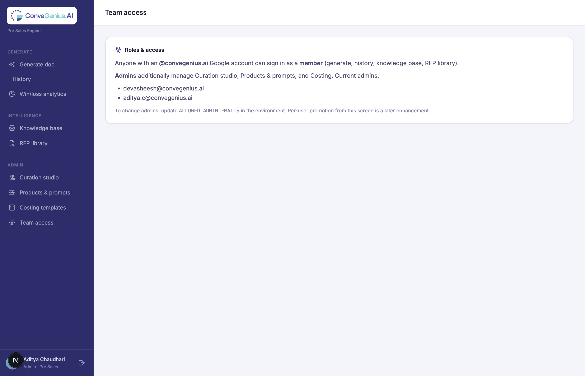

# ConveGenius Pre-Sales Engine — Admin Guide

**Audience:** Admins of the Pre-Sales Engine (currently **devasheesh@convegenius.ai** and **aditya.c@convegenius.ai**).
**Purpose:** Everything an admin can do — the controls members don't see, and how to use them to keep the engine accurate and improving over time.
**Read first:** the [User Guide](USER_GUIDE.md) covers the everyday workflow (generating, refining, exporting). This guide covers the **admin-only** capabilities on top of that.
**Live app:** https://proposal-engine-beta.vercel.app

---

## 1. What an admin is

Everyone who signs in with an `@convegenius.ai` account is a **member** — they can generate documents, refine, export, view history & analytics, and upload to the knowledge base / RFP library.

**Admins** can do all of that **plus** manage the engine itself through an **Admin** section in the sidebar that members never see:

| Admin capability | Where | What it controls |
|---|---|---|
| **Curation studio** | Sidebar → Curation studio | Best practices, proof points & boilerplate injected into every matching draft |
| **Products & prompts** | Sidebar → Products & prompts | The AI instructions behind each product and document type |
| **Costing templates** | Sidebar → Costing templates | The CM2 margin model |
| **Team access** | Sidebar → Team access | The role model (who's an admin) |

If you're an admin, you'll see the **Admin** group at the bottom of the sidebar. If you don't see it, you're signed in as a member.

> Admin controls are enforced on the server too — even if someone crafts a request directly, non-admins get a "403 Admins only" response. The hidden menu is convenience; the lock is real.

---

## 2. Who is an admin (and how to change it)

**Sidebar → Team access.**

- Current admins: **devasheesh@convegenius.ai**, **aditya.c@convegenius.ai**.
- Everyone else on the domain is a member.
- **To add/remove an admin today:** an engineer updates the `ALLOWED_ADMIN_EMAILS` setting (a comma-separated allowlist) in the app's environment and redeploys. In-app promotion from this screen is a planned enhancement.
- Role is decided by email at sign-in, so changes take effect the next time the person signs in.

---

## 3. Curation studio — the most important admin job

**Sidebar → Curation studio.** This is how the engine gets **stronger over time**. Entries you add here are injected into matching drafts as **authoritative guidance** — they carry more weight than the auto-retrieved knowledge base, because you've explicitly approved them.

### 3.1 The three entry types

- **Best practice / norm** — rules the model must follow. *Example: "Always anchor PAB notes to the state's Annual Work Plan and cite NAS/UDISE+ evidence before proposing an intervention."*
- **Proof point / fact** — approved figures to reuse verbatim. *Example: "VSK won the PM's National Innovation Award; live across 53,000 schools in Gujarat."* Keep these current and every future draft uses the right numbers.
- **Boilerplate** — standard approved sections to adapt. *Example: a standard SLA or organisational-capability paragraph.*

### 3.2 Adding or editing an entry (right panel)

1. Pick the **Type** (above).
2. Write a **Title** (how you'll recognise it) and the **Content** (the actual guidance/fact/text).
3. **Scope it** — this controls *where* it's injected:
   - **Applies to document types** — tick the generators it's relevant to (e.g. only *RFP response*). None ticked = **all** document types.
   - **Applies to products** — tick specific products (e.g. only *VSK 2.0*). None ticked = **all** products.
   - **State** — restrict to one state, or leave blank for all.
   - **Tags** — for your own organisation.
4. **Add entry** (or **Update entry** when editing).

### 3.3 Managing entries (left column)

Entries are grouped by type. For each:
- **Toggle** — enable/disable without deleting (disabled entries are kept but **not** injected).
- **Trash** — archive it.
- Click the title to load it into the editor.

### 3.4 How to curate well

- **Start with proof points.** Your real deployment numbers, awards, and reference contracts are the highest-value, lowest-risk additions — they make every draft concrete and accurate.
- **Scope tightly.** A norm that only applies to PAB notes should be scoped to *PAB proposal note*, so it doesn't clutter unrelated drafts.
- **Keep facts current.** When deployment numbers change, update the proof point once — every future draft follows.
- **Capture wins as norms.** When you learn what framing won a bid, write it as a best-practice entry so the whole team benefits.

---

## 4. Products & prompts — editing the AI instructions

**Sidebar → Products & prompts.** Edit the underlying instructions behind each **product** (e.g. VSK 1.0's system prompt) and each **document type** (e.g. how an "RFP response" is structured).

- Left column: **product system prompts** and **generator prompts**. A green **edited** badge marks ones that have been customised.
- Click any row → its prompt opens in the editor.
- Edit and **Save** → your version **overrides the built-in instruction for all future generations, for everyone**.
- **Reset to default** reverts to the original built-in prompt.

> **Use with care.** This changes every draft that uses that product or document type, for the whole team. Make focused edits, and prefer the **Curation studio** for additive guidance (proof points, norms) — it's safer and more granular than rewriting a core prompt. Product and module *names* live in code and aren't edited here; this only changes the AI instructions.

---

## 5. Costing templates — the CM2 model

**Sidebar → Costing templates.** A live CM2 margin calculator, and the model that powers the **CM2 margin analysis** document type.

- Enter budget (or leave blank to estimate from scale), schools/students, duration, and whether the bid is routed via a CPSU.
- **Recalculate** shows revenue → cost-line breakdown → CM1 → CM2, with the CM2 % flagged.
- The same engine feeds the **CM2 margin analysis** generator, so those internal memos use real numbers.

> CM2 figures are **internal**. They are only fed to the CM2 analysis document — they never appear in customer-facing proposals.

---

## 6. The knowledge base (shared, but admins should steward it)

The **Knowledge base** and **RFP library** (under *Intelligence*) are open to all members to upload to, but admins should **curate** them:

- Upload your **best winning proposals**, issued RFPs, and SOPs — the engine retrieves relevant ones (by state + keywords) into new drafts automatically.
- Archive low-quality or outdated documents so they don't dilute retrieval.
- Think of it as the engine's "memory": the better the material here, the better future drafts for similar states/topics.

See the User Guide §8–9 for the upload mechanics.

---

## 7. How the engine improves over time — the admin loop

Put together, the admin's job is a continuous loop:

1. **Win or lose a bid** → record the outcome (Won/Lost) on the proposal.
2. **Capture the learning** → add a best-practice **norm** (what framing worked) and any new **proof points** (new deployment, new numbers) in the Curation studio.
3. **Bank the asset** → upload the winning proposal to the **knowledge base**.
4. **Tune if needed** → adjust a product or generator **prompt** only when a systematic change is required.

Do this consistently and every new draft starts from a stronger base than the last.

---

## 8. What's not yet available (planned)

These were scoped but are not built yet — so you know the current boundaries:

- **Semantic (meaning-based) retrieval** from the knowledge base (today it's keyword + state matching).
- **One-click "promote a won proposal into the knowledge base."**
- **Structured Won/Lost reason capture** that feeds analytics and curation automatically.
- **Prompt change history / who-changed-what** with revert.
- **In-app admin promotion** (today admins are set via the environment allowlist).

---

## 9. Admin responsibilities checklist

- [ ] Keep **proof points** current in the Curation studio (deployments, awards, numbers).
- [ ] Add a **best-practice norm** after each notable win or loss.
- [ ] Upload winning proposals & issued RFPs to the **knowledge base**; archive stale ones.
- [ ] Review **prompt edits** before saving — they affect everyone.
- [ ] Keep the **admin list** tight; remove people who no longer need it.
- [ ] Don't upload anything to shared stores you wouldn't want the whole pre-sales team to see.
