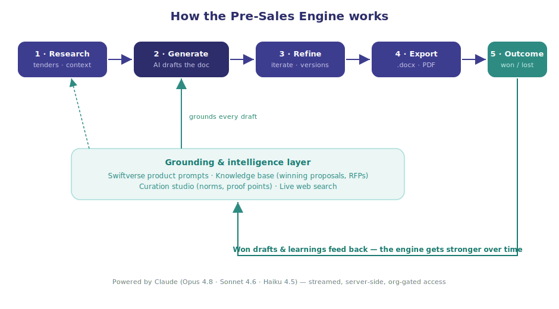

# ConveGenius Pre-Sales Engine — Product Overview

*The complete picture: what it is, why it exists, what's possible, and how it works.*

**Live:** https://proposal-engine-beta.vercel.app
**Companion docs:** [User Guide](USER_GUIDE.md) (how to use each feature) · [Admin Guide](ADMIN_GUIDE.md) (admin controls)

---

## 1. In one line

> An AI workspace that helps the ConveGenius pre-sales team **find, research, and win** government education deals — by drafting proposals, RFP responses, and notes in minutes, grounded in CG's products and its own winning material, and getting smarter with every bid.

## 2. What it is

The Pre-Sales Engine is an internal, team-wide web application. It turns the slow, repetitive parts of pre-sales — researching the landscape, structuring a proposal, writing the first draft, tailoring it to an RFP, computing margins — into a guided, AI-assisted flow.

It is **not** a generic ChatGPT wrapper. It knows the **Swiftverse product catalogue** (VSK, VAI, individual modules), it writes in **government-procurement language** (PAB notes, QCBS, GeM, Samagra Shiksha), and it draws on **your team's own winning proposals and curated best practices** so every draft starts from CG's accumulated knowledge — not a blank page.

Three things make it more than a document generator:
1. **Research** — a chat that searches the live web to hunt opportunities and answer questions, with citations.
2. **Grounding** — every draft is shaped by CG product prompts, past winning material, and admin-curated norms and proof points.
3. **A learning loop** — winning drafts and learnings feed back in, so the engine improves over time.

## 3. Why it exists — the problem

Government education pre-sales is high-effort and knowledge-heavy:
- Opportunities (tenders, RFPs, EOIs, PAB funding lines) are scattered and time-sensitive.
- Every proposal re-derives the same CG positioning, deployment proof points, and compliance language from scratch.
- Quality depends on who writes it and what past material they can find.
- RFP responses must address *every* clause — easy to miss requirements under deadline.
- Knowledge (what framing won, which numbers are current) lives in people's heads and old files.

The engine compresses days of drafting into minutes, makes the *best* version of CG's knowledge available to everyone, and captures learnings so the whole team levels up.

## 4. Who it's for

| Persona | What they get |
|---|---|
| **Pre-sales member** | Research the ecosystem, generate and refine proposals/notes, attach RFPs, export to Word/PDF, track outcomes. |
| **Admin / curator** | Everything a member can do, plus: maintain best-practice norms and proof points, edit the AI prompts, manage the CM2 costing model, and steward the shared knowledge base. |
| **Leadership** | Win/loss analytics — win rate and breakdowns by state, product, and document type. |

## 5. What's possible — capability map

**Create**
- Six document types: full **proposal**, **PAB proposal note**, **RFP response**, **CM2 margin analysis**, **executive summary**, **concept note**.
- Across the full **Swiftverse catalogue**: VSK platforms (1.0/2.0/3.0 with per-module selection), VAI packages (with surround support), and individual modules/bots.
- For any state, department, scale, budget, and PSU-routing (TCIL/RailTel/NIC) scenario.

**Research**
- A chat workspace with **live web search** to find current tenders/schemes/budgets and do secondary research, with cited sources.
- A **model picker** (Opus 4.8 / Sonnet 4.6 / Haiku 4.5) to trade quality against speed and cost.
- **Draft documents directly from the chat** — it drives the same generation pipeline and hands you the draft.

**Improve quality**
- **Attach an RFP** and the response addresses every requirement.
- **Automatic grounding (RAG):** relevant past winning proposals and RFPs are pulled in by state and topic.
- **Curation:** admins maintain norms, approved proof points, and boilerplate that steer every matching draft.
- **CM2 auto-calculation:** revenue → cost → CM1 → CM2 from budget and scale (internal only).

**Work with output**
- **Refine** any draft with plain-English instructions; full **version history**, compare, and restore.
- **Export** to `.docx` and **PDF**.
- **Track outcomes** (Won/Lost/In review) — feeding analytics and the learning loop.

**Govern & learn**
- **Roles** (admin vs member) with admin-only controls.
- **Win/loss analytics** dashboard.
- Editable **product/generator prompts** and a **knowledge base / RFP library** the team builds over time.

## 6. How it works

At the centre is **Claude** (Anthropic's AI), called securely on the server and streamed live to the screen. Around it sits a **grounding & intelligence layer** that makes the output CG-specific:

- **Product prompts** — each Swiftverse product carries an expert system prompt (its positioning, modules, differentiators). Admins can edit these.
- **Knowledge base (RAG)** — uploaded winning proposals, RFPs, and SOPs are retrieved by state and keywords and injected as reference so drafts reuse proven framing and data.
- **Curation studio** — admin-maintained best-practice norms, approved proof points (deployments, awards, numbers), and boilerplate, injected as *authoritative* guidance.
- **Live web search** — in the research chat, for anything current.

The **value loop**: Research → Generate → Refine → Export → Outcome. When a bid is marked **Won**, that draft and its learnings can be folded back into the knowledge base and curation — so the next draft starts stronger. That feedback loop is what makes the engine compound in value.

## 7. A day in the life

1. **Hunt.** In Research chat: *"Which states have open FLN/NIPUN tenders right now?"* — it searches the web and answers with sources.
2. **Qualify.** *"Summarise Rajasthan's 2025 Samagra Shiksha priorities and where VSK 2.0 fits."*
3. **Draft.** Either ask the chat to draft a concept note, or use the Generate screen: pick VSK 2.0, tick modules, set state/scale/budget, attach the RFP.
4. **Tailor.** The draft streams in, grounded in CG's prompts + a past HP winning bid + curated proof points. Refine the risk section; compare versions.
5. **Ship.** Export to PDF, send internally for review.
6. **Close the loop.** Mark it Won; the admin adds the winning framing as a norm and uploads the proposal to the knowledge base. The next Rajasthan draft is better.

## 8. What it produces & supports

**Document types:** Proposal · PAB proposal note · RFP response · CM2 margin analysis · Executive summary · Concept note.

**Products:** VSK 1.0 / 2.0 / 3.0 (modular, per-module selection) · VAI packages (with optional surround support) · 40+ individual modules/bots (NIPUN Bot, TPD Bot, FMB, TIMS, PLC, OCR, etc.).

**Context it understands:** Indian government school education — Samagra Shiksha, PAB, NEP 2020, NIPUN Bharat, NAS/UDISE+/PARAKH, APAAR, GeM, QCBS, CPSU routing.

## 9. Roles & access

- Sign-in is **Google, restricted to `@convegenius.ai`** — no other accounts.
- **Members:** generate, research, refine, export, history, analytics, knowledge base, RFP library.
- **Admins** (currently **devasheesh@convegenius.ai**, **aditya.c@convegenius.ai**): also Curation studio, Products & prompts, Costing templates, Team access. Admin controls are enforced server-side, not just hidden.

## 10. What makes it different

- **CG knowledge built in** — products, positioning, and gov-procurement language, not a blank assistant.
- **Grounded, not generic** — drafts reuse your real winning material and curated proof points.
- **Improves over time** — the curation + outcome loop compounds; most tools are static.
- **Research + drafting in one** — find the opportunity and write the bid in the same place.
- **Multi-model** — choose quality vs. cost per task.
- **Team memory** — shared history, knowledge base, and analytics.

## 11. Under the hood (high level)

- **Frontend & hosting:** Next.js on Vercel.
- **AI:** Claude (Opus 4.8 default; Sonnet 4.6 / Haiku 4.5 selectable in chat), called server-side and streamed; web search and an agentic document-generation tool.
- **Database:** Neon Postgres (proposals, versions, knowledge, curation, chats, users).
- **File storage:** Vercel Blob (uploaded RFPs and knowledge documents).
- **Auth:** Auth.js with Google, org-domain gated.
- **Security/privacy:** the AI key never leaves the server; output is sanitised before display; uploaded RFP text is treated as untrusted reference data. All shared data is visible to signed-in team members — don't upload anything the whole team shouldn't see.

## 12. Status — what's live today

Built and deployed across six phases:
1. **Foundation + core loop** — auth, persisted generation, history, refine, export, outcomes.
2. **Knowledge & admin** — knowledge base / RFP library, editable product & generator prompts.
3. **Output quality** — RAG grounding, CM2 auto-calc.
4. **Comparison & analytics** — version history/compare/restore, win/loss dashboard.
5. **Roles & Curation studio** — admin roles, best-practice/proof-point/boilerplate curation.
6. **Research chat** — agentic chat with live web search, model picker, and draft-from-chat.

Plus: `.docx` + PDF export, full mobile support.

## 13. Roadmap — what's next (not yet built)

- **Semantic (meaning-based) retrieval** from the knowledge base (today it's keyword + state).
- **One-click "promote a won proposal into the knowledge base."**
- **Structured Won/Lost reason capture** feeding analytics and curation automatically.
- **Prompt change history** with who-changed-what and revert.
- **In-app admin promotion** (today admins are set via an environment allowlist).
- **Deeper opportunity tracking** (pipeline/CRM-style views).

## 14. What it is *not*

- Not a replacement for your judgement — drafts are strong starting points to review and tailor, not final documents.
- Not a CRM or tender-scraping service (it researches on demand; it doesn't continuously monitor sources yet).
- Not a public tool — it's internal to ConveGenius pre-sales.

## 15. Glossary

- **Swiftverse / VSK / VAI** — CG's product platforms and packages.
- **PAB** — Project Approval Board (Samagra Shiksha funding approval).
- **RAG** — retrieval-augmented generation; pulling relevant past material into the prompt.
- **CM1 / CM2** — contribution margin levels used in the costing model.
- **Grounding** — shaping the AI's output with CG-specific context (prompts, knowledge, curation).
- **Curation** — admin-maintained guidance (norms, proof points, boilerplate) injected into drafts.
