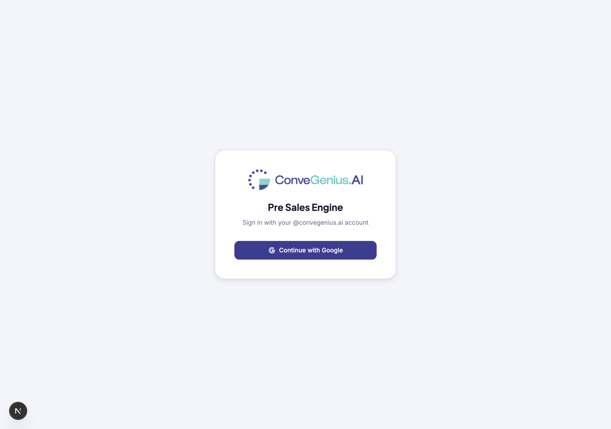
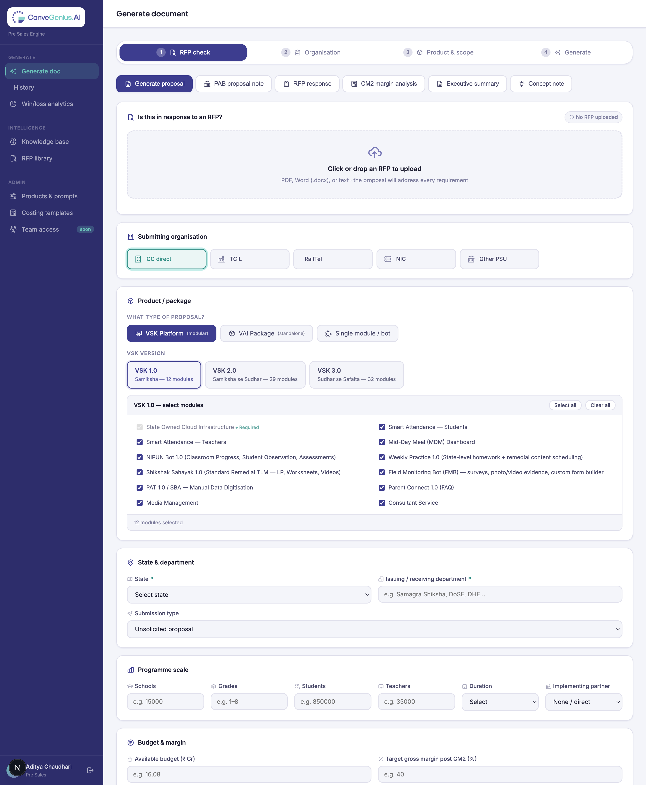
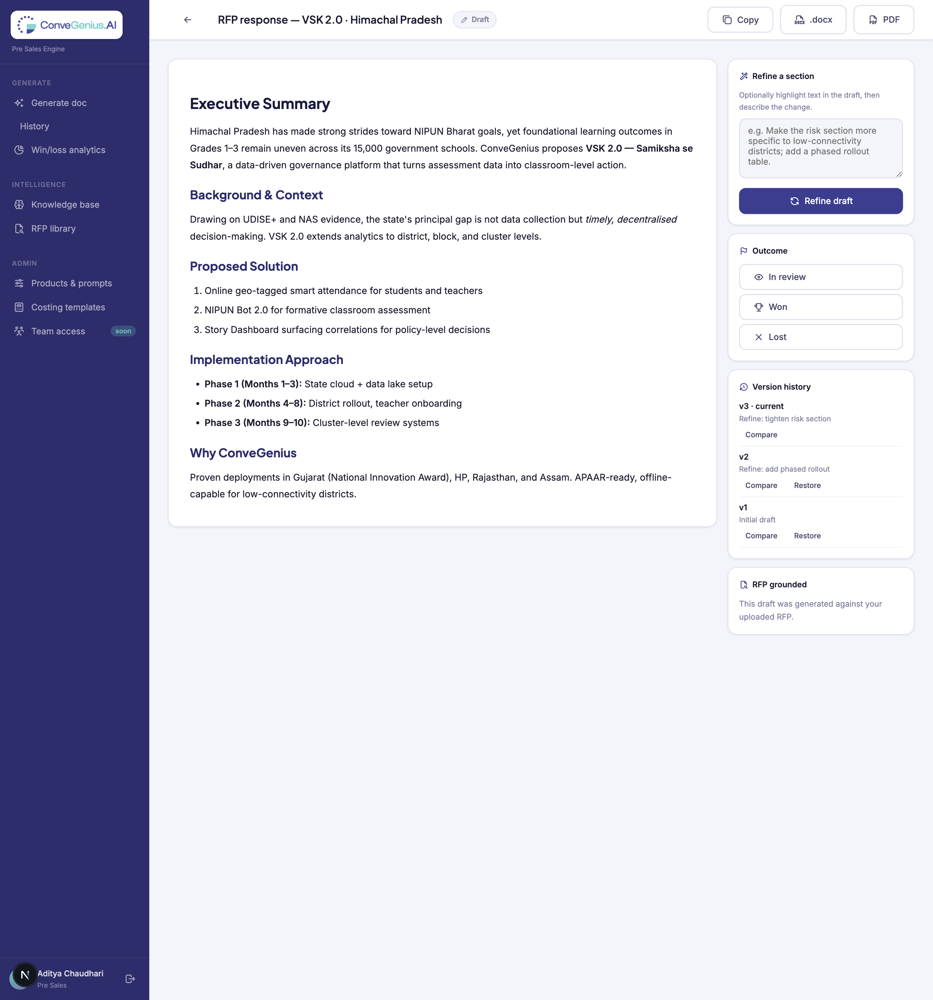
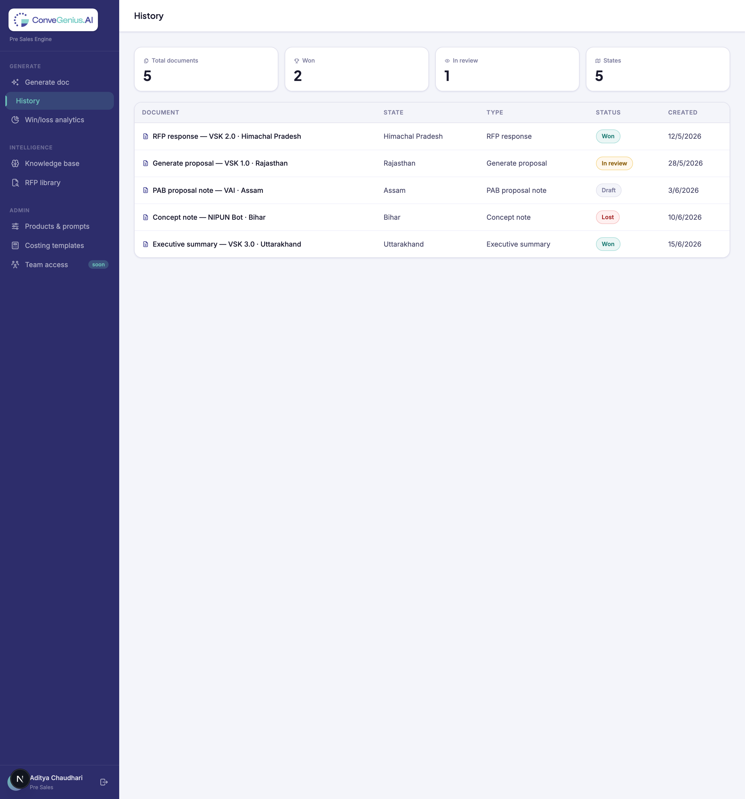
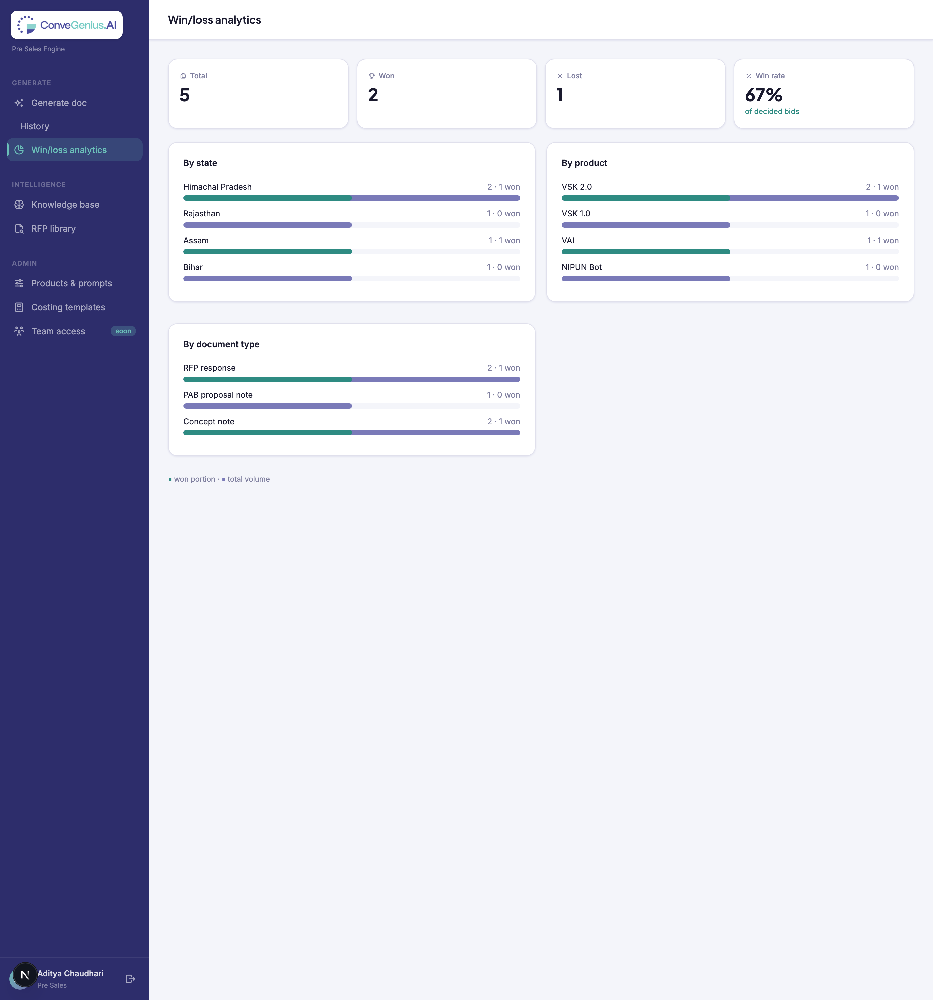
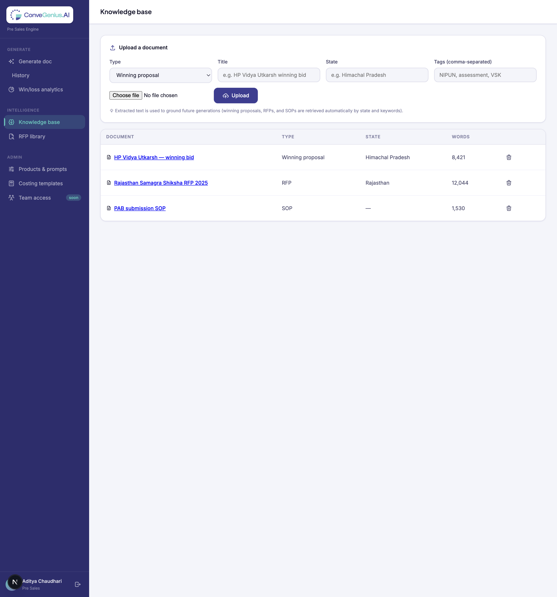
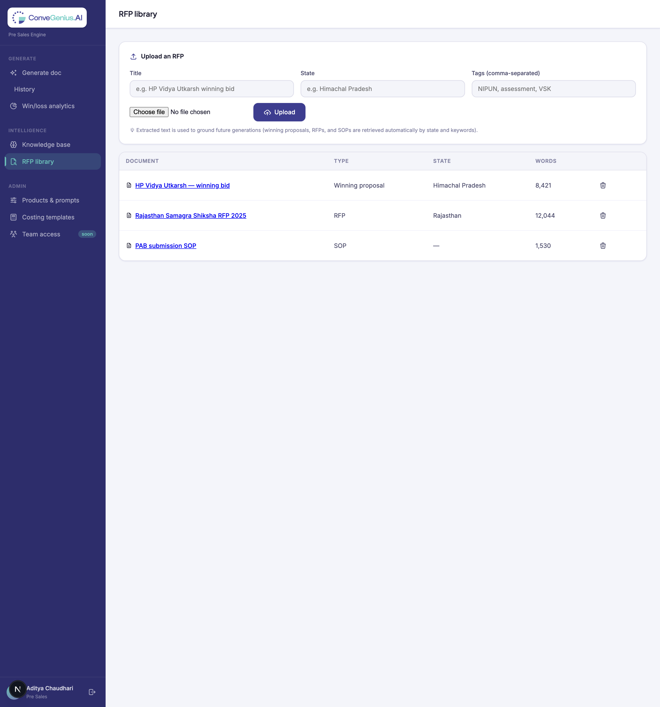
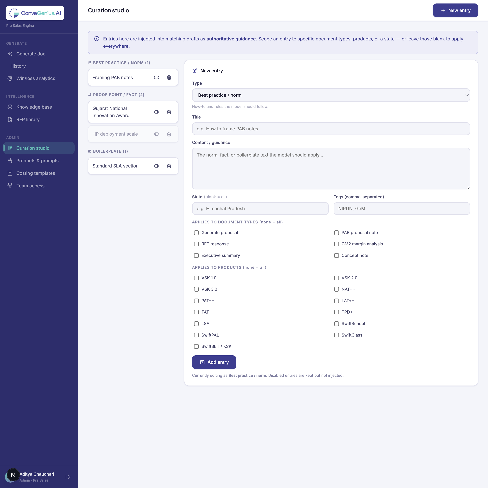
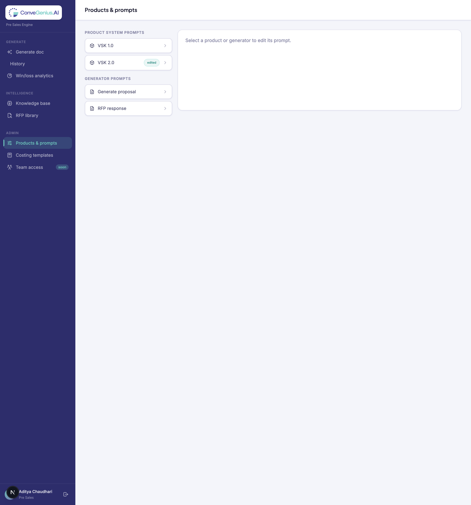
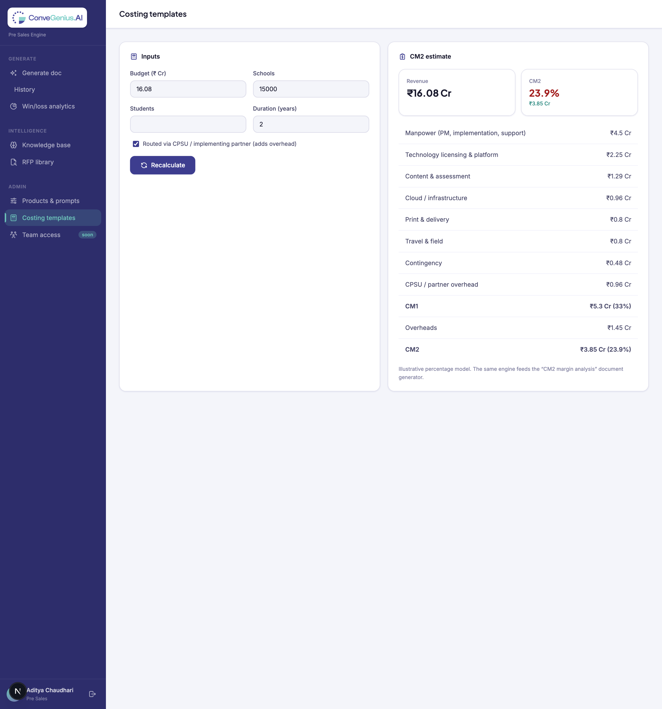

# ConveGenius Pre-Sales Engine — User Guide

**Audience:** ConveGenius pre-sales team
**Purpose:** Pre-read before the hands-on training session. Read this end-to-end; it explains every feature, where to find it, and how to use it.
**Live app:** https://proposal-engine-beta.vercel.app

---

## 1. What this tool is

The Pre-Sales Engine drafts government education proposals for you using AI (Claude). You pick the document type and the Swiftverse product, fill in the project details (state, scale, budget, context), optionally attach the RFP, and the engine writes a structured first draft in seconds. You can then refine it, export it to Word/PDF, track whether the bid was won or lost, and build a knowledge base that makes future drafts sharper.

It is a **shared team tool** — proposals, history, the knowledge base, and analytics are visible to the whole team, not just you.

**What it does well:** fast, well-structured first drafts grounded in CG's products, your RFP, and past winning material. **What it does not do:** replace your judgement. Always review and tailor a draft before it goes to a customer.

---

## 2. Signing in

Go to **https://proposal-engine-beta.vercel.app**. You'll see the sign-in screen.

- Click **Continue with Google** and use your **@convegenius.ai** account.
- Only `@convegenius.ai` accounts can sign in — personal Gmail or other domains are blocked by design.
- You stay signed in across sessions; use the **sign-out** icon at the bottom-left of the sidebar to log out.

---

## 3. Getting around — the sidebar

Everything is reached from the left sidebar, grouped into three sections:

| Section | Item | What it's for |
|---|---|---|
| **Generate** | Generate doc | Create a new document (the main workflow) |
| | History | Every document the team has generated |
| | Win/loss analytics | Win rate and breakdowns by state / product / type |
| **Intelligence** | Knowledge base | Upload winning proposals, RFPs, SOPs (powers grounding) |
| | RFP library | All uploaded RFPs in one place |
| **Admin** *(admins only)* | Curation studio | Maintain best practices, proof points & boilerplate that steer drafts |
| | Products & prompts | Edit the AI instructions per product / document type |
| | Costing templates | The CM2 margin calculator |
| | Team access | Who's an admin vs a member |

> **Roles:** everyone who signs in is a **member** (Generate, History, Analytics, Knowledge base, RFP library). **Admins** also see the **Admin** section. The current admins are **devasheesh@convegenius.ai** and **aditya.c@convegenius.ai**. If you're a member, the Admin section simply won't appear in your sidebar.

On a phone the sidebar collapses to icons — tap any icon to navigate.

---

## 4. Generating a document — the core workflow

Click **Generate doc**. This is where you'll spend most of your time.

Work top to bottom. The four-step bar at the top (RFP check → Organisation → Product & scope → Generate) is a progress reminder, not separate pages — everything is on one screen.

### 4.1 Choose the document type (the row of tabs)

The tabs near the top pick **what kind of document** to write. The selected one is highlighted:

- **Generate proposal** — a full government proposal (all standard sections).
- **PAB proposal note** — a Samagra Shiksha PAB funding note in the standard format.
- **RFP response** — a technical proposal that answers every section/criterion of an uploaded RFP.
- **CM2 margin analysis** — an internal finance memo (uses the costing engine; not for customers).
- **Executive summary** — a 2-page summary for a Secretary / Mission Director.
- **Concept note** — a shorter, early-stage note to open a conversation.

### 4.2 Attach an RFP (optional)

Under **"Is this in response to an RFP?"**, click the upload zone or drag a file in (PDF, Word, or text). The engine extracts the text on the server and the draft will then **address every requirement in the RFP**. Uploading also auto-sets the submission type to "Response to RFP". Use **Remove** to clear it.

> If a scanned/image-only PDF won't extract, paste the key RFP content into the **Context** box instead (Section 4.7).

### 4.3 Submitting organisation

Pick who is bidding: **CG direct**, or via a PSU — **TCIL / RailTel / NIC / Other PSU**. If you pick a PSU, a **PSU context** box appears — describe the PSU's role (lead bidder, GeM compliance, etc.); it shapes how the proposal is framed.

### 4.4 Product / package (three ways to choose)

This is the Swiftverse selector. First pick the **type**:

- **VSK Platform (modular)** — pick a version (VSK 1.0 / 2.0 / 3.0), then **tick the exact modules** included in this proposal. Mandatory modules are always on. Use *Select all / Clear all* to start fast. The draft only describes the modules you tick.
- **VAI Package** — pick a standalone PAB-ready bundle; optionally tick **surround support** add-ons.
- **Single module / bot** — search (e.g. "NIPUN Bot", "TPD", "FMB", "OCR") and select one module.

### 4.5 State & department

- **State** (required) and **issuing/receiving department** (required, e.g. "Samagra Shiksha").
- **Submission type** (unsolicited, RFP response, PAB note, GeM, EOI).

### 4.6 Programme scale

Schools, grades, students, teachers, duration, and implementing partner. Numbers make the draft concrete — fill in whatever you know. Leave blank what you don't.

### 4.7 Budget & margin, Context & differentiators

- **Budget (₹ Cr)** and **target CM2 (%)** — used by the CM2 analysis and to size the proposal.
- **Key objectives or context** — the single highest-impact field. Add deadlines, incumbent vendors, prior CG deployments, competitive intel. The more here, the better the draft.
- **Key differentiators** — what to emphasise (existing deployments, APAAR integration, offline capability, lower per-school cost…).

### 4.8 Generate

Click the **Generate** button at the bottom. The draft streams in live on the next screen. Required fields are **State**, **Department**, and a selected **Product** — if one is missing you'll see a red message telling you what to add.

---

## 5. The output screen — reading, refining, exporting

When generation finishes you land on the output view.

### 5.1 Read & copy

The draft renders as a formatted document (headings, lists, bold). Use **Copy** (top-right) to copy the full text to your clipboard.

### 5.2 Export

- **.docx** — downloads a Word document.
- **PDF** — downloads a PDF.

Both use the document's title as the filename.

### 5.3 Refine a section

Right panel → **Refine a section**:

1. *(Optional)* highlight a passage in the draft you want changed.
2. Type an instruction — e.g. *"Make the risk section specific to low-connectivity districts and add a phased rollout table."*
3. Click **Refine draft**.

The engine returns a full revised draft. Each refine is saved as a **new version** (see 5.5) — nothing is lost.

### 5.4 Mark the outcome

Right panel → **Outcome** → **In review / Won / Lost**. This feeds History and the Win/loss analytics, so keep it updated as bids progress.

### 5.5 Version history & compare

Once you've refined at least once, a **Version history** card lists every version (v1 = initial draft, then each refine):

- **Compare** — shows that version side-by-side with the current draft.
- **Restore** — brings an older version back as the current draft (saved as a new version, so it's reversible).

### 5.6 RFP grounded

If you attached an RFP, an **RFP grounded** note confirms the draft was written against it.

---

## 6. History

**Sidebar → History.** Every document the team has generated, newest first, with live metric cards (total, won, in-review, states).

Click any row to reopen that document in the output view (read, export, refine, or update its outcome).

---

## 7. Win/loss analytics

**Sidebar → Win/loss analytics.** A dashboard of how the team is doing.

- Top cards: **total, won, lost, win rate** (win rate is of *decided* bids).
- Breakdowns **by state, by product, and by document type** — each bar shows total volume (navy) with the won portion (teal) on top, so you can see where you win.

---

## 8. Knowledge base

**Sidebar → Knowledge base.** This is what makes drafts get better over time.

Upload your best material — **winning proposals, RFPs, SOPs, exhibits, theory-of-change docs**:

1. Pick the **type**, give it a **title**, set the **state** and **tags**.
2. Choose a file (PDF / Word / text) and click **Upload**.

The engine extracts the text and stores it. From then on, **when you generate for a matching state or topic, the engine automatically pulls in relevant past material as reference** — so new drafts reuse proven framing, data points, and structure. The more (and better) you upload, the stronger future drafts. Use the trash icon to archive a document.

---

## 9. RFP library

**Sidebar → RFP library.** The same upload-and-list experience as the knowledge base, but filtered to **RFPs only** — a single place to find every RFP the team has worked on. Uploaded RFPs also feed grounding.

---

## 10. Admin — Curation studio *(how the engine gets stronger)*

**Sidebar → Curation studio.** *(Admins only)* This is where a curator keeps the engine sharp over time. Entries here are injected into matching drafts as **authoritative guidance** — stronger than the auto-retrieved knowledge base.

Three kinds of entries (left column, grouped):

- **Best practice / norm** — rules the model should follow (e.g. "Always anchor PAB notes to the state's Annual Work Plan and cite NAS/UDISE+ evidence").
- **Proof point / fact** — approved figures to reuse verbatim (deployments, awards, reference numbers).
- **Boilerplate** — standard approved sections (SLA, capability) to adapt.

To add or edit (right panel): pick the **type**, write a **title** and the **content**, then **scope** it — tick the document types and/or products it applies to, and optionally a state. Leave the ticks empty to apply everywhere. Use the **toggle** to enable/disable an entry without deleting it, and the **trash** icon to archive it.

> Keep proof points current here and every future draft uses the right numbers. This is the single best lever for improving quality over time — invest in it.

---

## 11. Admin — Products & prompts

**Sidebar → Products & prompts.** *(Admins only)* Edit the AI instructions behind each product and each document type.

- Left column: **product system prompts** (VSK 1.0, 2.0, …) and **generator prompts** (Generate proposal, RFP response, …). A green **edited** badge marks ones you've customised.
- Click any row → its prompt opens in the editor on the right.
- Edit and click **Save**. Your edit **overrides the built-in instruction for all future generations**, for everyone. **Reset to default** reverts it.

> Treat this carefully — changing a prompt changes every draft that uses it. Product/module *names* stay fixed in code; this only edits the AI instructions.

---

## 12. Admin — Costing templates (CM2)

**Sidebar → Costing templates.** *(Admins only)* A live CM2 margin calculator.

Enter budget (or leave blank to estimate from scale), schools/students, duration, and whether it's routed via a CPSU. **Recalculate** shows revenue → cost breakdown → CM1 → CM2, with the CM2 % flagged. The same engine feeds the **CM2 margin analysis** document type — so those memos use real numbers. (CM2 figures are internal and never appear in customer-facing proposals.)

---

## 13. Team access — roles

**Sidebar → Team access.** *(Admins only)* Shows the role model: everyone on `@convegenius.ai` signs in as a **member**; **admins** (devasheesh@convegenius.ai, aditya.c@convegenius.ai) additionally manage Curation studio, Products & prompts, and Costing. To change the admin list today, an engineer updates the `ALLOWED_ADMIN_EMAILS` setting; in-app promotion is a later enhancement.

---

## 14. Tips for the best drafts

1. **Fill the Context box.** It's the biggest lever on quality — deadlines, incumbent, prior deployments, competitive intel.
2. **Attach the RFP** whenever there is one, and use **RFP response** as the document type.
3. **Be specific with numbers** (schools, students, budget) — they make the draft concrete.
4. **Tick only the modules** that are actually in scope.
5. **Upload winning proposals** to the knowledge base — they directly improve future drafts for similar states/topics.
6. **Refine iteratively** rather than expecting a perfect first pass; use Compare to check changes.
7. **Always review before sending.** The draft is a strong starting point, not a final document.

---

## 15. FAQ / troubleshooting

- **"Access blocked" on Google sign-in** → you're not on an `@convegenius.ai` account, or you used the wrong Google profile.
- **My RFP won't extract text** → it's likely a scanned/image PDF. Paste the key requirements into the Context box instead.
- **The draft stopped early / errored** → try again; if it persists, reduce the number of modules or shorten the context, and tell the admin.
- **A teammate's edit changed my prompt output** → prompt edits in *Products & prompts* are global. Check there (look for the "edited" badge) and *Reset to default* if needed.
- **Where is my document?** → everything is saved automatically; find it under **History**.

---

## 16. A note on data

Proposals, uploaded files, history, and the knowledge base are stored in the team's database and file storage and are visible to all signed-in team members. Don't upload anything you wouldn't want the whole pre-sales team to see.
